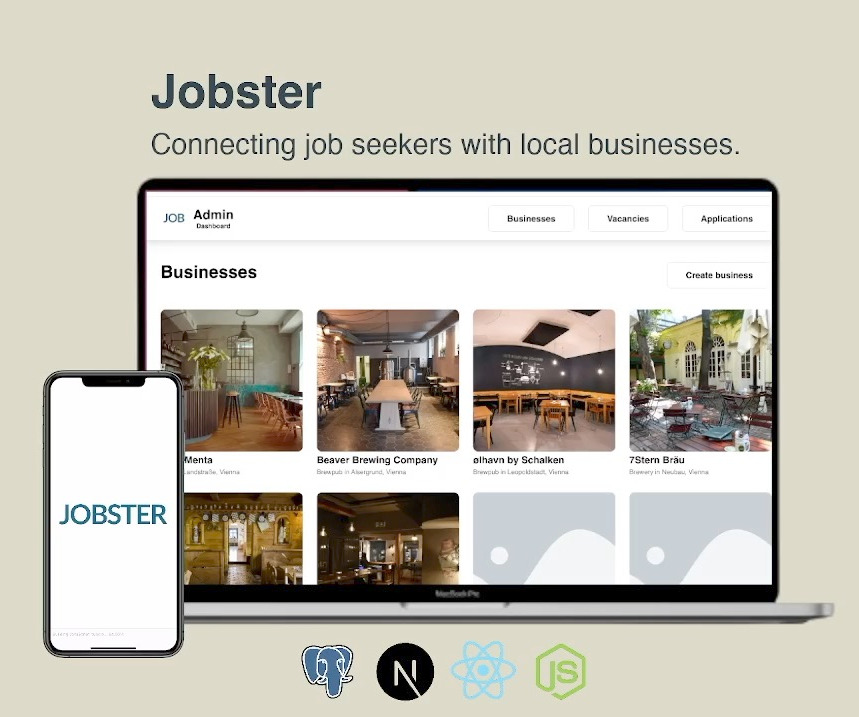

# Jobster

## Connecting job seekers with local businesses.

Jobster is a two-sided marketplace that connects semi-skilled job seekers with local businesses. The ecosystem includes an admin web interface to manage business accounts, job vacancies and user applications, as well as a mobile app where job seekers can find and apply for jobs. Both apps share the same Next.js backend, which is connected to a PostgreSQL database. The dominant coding language used is TypeScript, and Tailwind CSS is used for styling.

<table>
  <tr>
    <td></td>
  </tr>
</table>

### Technologies

- Frontend: React Native with TypeScript, Tailwind CSS.
- Backend: Next.js, PostgreSQL

### Features

- App (mobile app)

  - Browse local businesses
  - View nearest metro/tram station
  - Businesses hiring urgently are labelled
  - Apply for vacant positions
  - Manage own applications
  - Upload profile image
  - Identifier-first authentication
  - SMS OTP verification & passwordless login

- Web (admin dashboard)
  - CRUD business accounts
  - CRUD job vacancies
  - CRUD job applications
